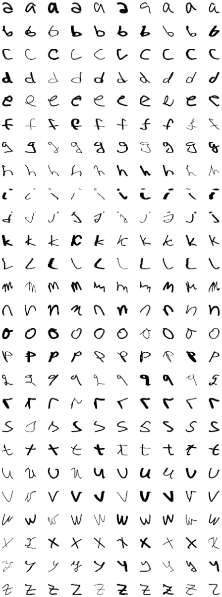

# Letters Recognition Models

Training and dataset-generation project for handwritten letter recognition. This repository contains the Python/TensorFlow models and C++ preprocessing tools used to build classifiers for single letters, two-letter components, and one-letter-vs-bigram detection.



## What it does

- Prepares handwritten letter images into normalized training components.
- Generates two-letter datasets for ambiguous connected handwritten components.
- Trains CNN classifiers for:
  - single lowercase letters (`a-z`),
  - whether a component is one letter or a bigram,
  - the first letter in a bigram,
  - the second letter in a bigram.
- Produces evaluation reports: accuracy/loss curves, confusion matrices, class reports, and score summaries.
- Includes a DCGAN experiment for generating additional handwritten letter samples.

## Results

| Model | Test accuracy |
| --- | ---: |
| Single-letter classifier | 98.23% |
| One-letter vs. bigram classifier | 99.34% |
| First letter in bigram | 96.13% |
| Second letter in bigram | 96.44% |

## Tech Stack

- Python
- TensorFlow / Keras
- NumPy, Matplotlib
- OpenCV image preprocessing utilities
- C++ / CMake preprocessing tools
- DCGAN experiment for letter generation

## Repository Layout

```text
.
|-- components/      # C++ tool for extracting smaller letter images
|-- merge/           # C++ tool for generating bigram datasets
|-- demo/            # notebook outputs and visual prediction examples
|-- model/           # trained Keras .h5 models
|-- report/          # metrics, curves, confusion matrices, reports
|-- dcgan/           # handwritten-letter generation experiment
|-- include/         # shared C++ image helper code
|-- model.py         # CNN architecture and training helpers
|-- network.py       # one-letter and bigram-position training entry point
`-- network_one_two.py
```

## Training Workflow

1. Prepare single-letter components:

```bash
cd components
mkdir build && cd build
cmake .. && cmake --build .
./main ../../dataset/train/one_letter prepare
./main ../../dataset/validation/one_letter prepare
./main ../../dataset/test/one_letter prepare
```

2. Generate two-letter datasets:

```bash
cd merge
mkdir build && cd build
cmake .. && cmake --build .
./main train first
./main validation first
./main test first
./main train second
./main validation second
./main test second
```

3. Train recognition models:

```bash
python3 network.py one
python3 network.py first
python3 network.py second
python3 network_one_two.py
```

4. Train or use the DCGAN experiment:

```bash
python3 dcgan/dcgan.py a train
python3 dcgan/dcgan.py a generate
```

## Role in the Text Recognition System

This repository provides the trained models for the companion [Handwritten Text Recognition](../master_text_recognition) project. The recognizer loads exported models to classify segmented components, then combines the predictions with word-level correction to produce final text.
